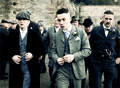

<body>
<h1 align="center"> ⬇️ 𝙒𝙚𝙡𝙘𝙤𝙢𝙚 𝙩𝙤 𝙢𝙮 𝙥𝙧𝙤𝙛𝙞𝙡𝙚 ⬇️ </h1>
 

<!---->

 
 <!--gif line-->

<h2 align="center"> 💬 𝘼𝙗𝙤𝙪𝙩 𝙢𝙚 🗨️ </h2>
 <!--custom gif-->
<li>
<b>Full-Name:</b> <h4><b>Nguyen Hoang Khoi</b></h4> </li>
<li>
<b>Gender:</b> Male, boy!
</li>
<li>
<b>Hobbies:</b>
</li>
 

<b>     Thanks for reading about my personal stuff 
                                 💯❤️‍🔥</b>

<h2 align="left">            📇 𝙆𝙣𝙤𝙬𝙡𝙚𝙙𝙜𝙚/ 𝙆𝙣𝙤𝙬𝙣 𝙖𝙗𝙤𝙪𝙩 📇</h2>

 <!--custom gif-->

 
 
 
 

I'm mostly work with <!--content-->

 
<h2 align="center">⌨️ 𝙒𝙤𝙧𝙠 𝙀𝙭𝙥𝙚𝙧𝙞𝙚𝙣𝙘𝙚 🖱️</h2>

 <!--gif background-->
 
 
<h2 align="right">📝 𝘾𝙤𝙣𝙩𝙖𝙘𝙩 𝙢𝙚 📝            </h2>
 <!--contact gif-->
 

Here are some of my   
most used social info ヽ(o＾▽＾o)ノ

   📱: phone
 <!--social media-->

 

 
 
 
 
 
 
 
 
 
 
 
 <!--custom gif-->
 
 
 
 
 
 
 
 
 
 
 
 
 
 
 

<h2 align="center">💖 𝙏𝙝𝙖𝙣𝙠𝙨 𝙛𝙤𝙧 𝙬𝙖𝙡𝙠𝙞𝙣𝙜 𝙩𝙝𝙧𝙤𝙪𝙜𝙝 𝙢𝙮 𝙥𝙧𝙤𝙛𝙞𝙡𝙚! 💖</h2>

 <!--the end gif-->

</body>